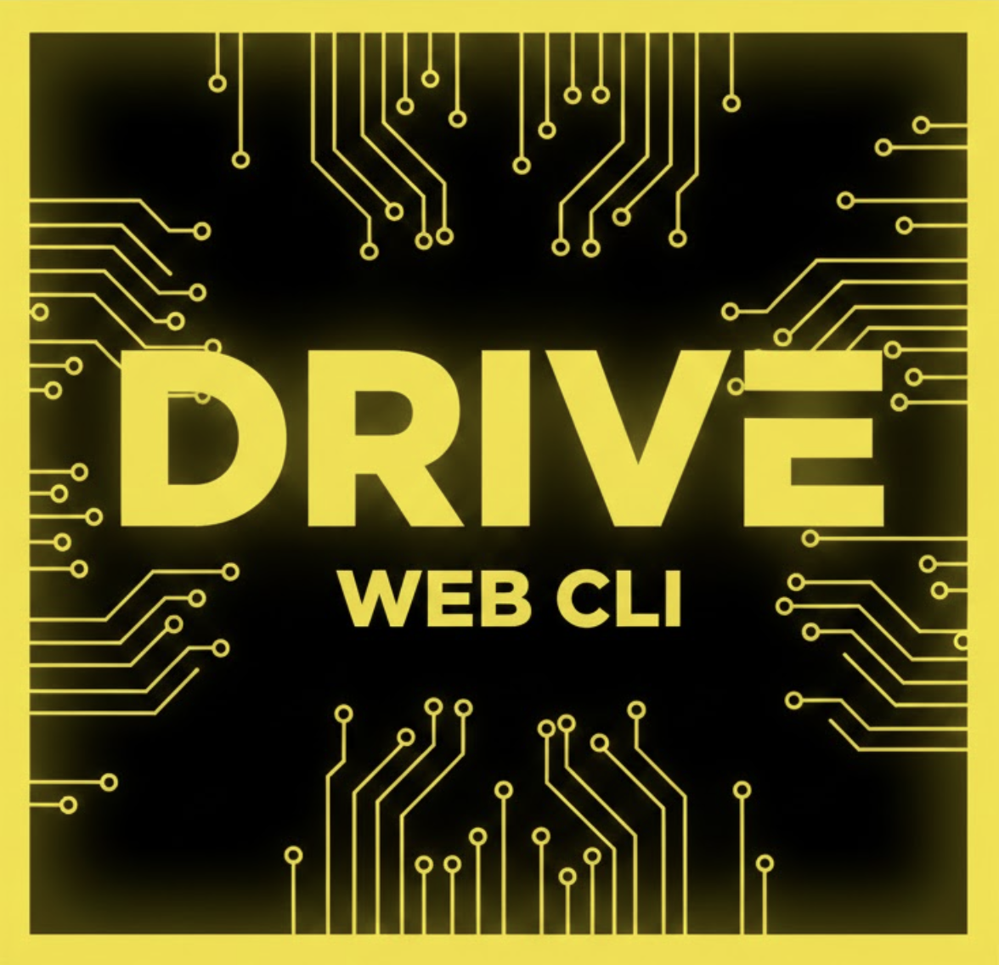
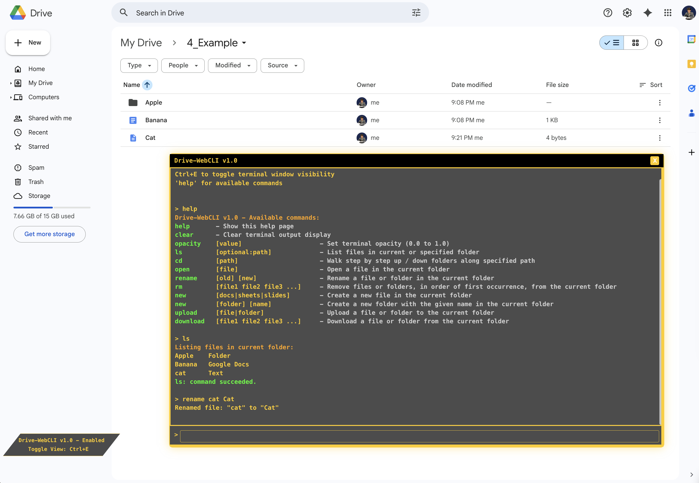

# Drive-WebCLI

A light-weight Chrome Extension enabling an in-browser CLI for Google Drive.

## Installation

1. Clone the repository / download as ZIP and extract into a local directory.
2. Open `chrome://extensions/` in Chrome.
3. Enable "Developer mode".
4. Click "Load unpacked" and select the project directory.

## Usage

Drive-WebCLI is automatically enabled in any `https://drive.google.com/*`  tab created after installing and turning on the Extension.

Ctrl+E / Control+E (Mac) toggles terminal visibility.  The terminal interface is draggable and resizeable, and background opacity settings can be customized.

Entering `help` displays currently implemented commands and their respective usages.

List of some implemented commands:
* `ls [optional:path]` - List all files in the current Drive folder or folder specified at path (relative or starting from root `~`).
* `cd [path]` - Open the given Driven folder at the given path (relative to the current Drive folder or starting from root `~`).
* `open [file]` - Open a file or folder in the current Drive folder (follows default Drive behavior when deciding to open in a new tab or the current one).
* `rename [old] [new]` - Rename a file or folder in the current Drive folder.
* `rm [file1 file2 file3 ...]` - Remove all listed files or folders from the current Drive folder, in order of first occurence.
* `upload [file|folder]` - Upload a local file or folder to the current Drive folder.
* `download [file1 file2 file3 ...]` - Download a file or folder from the current Drive folder.
* `opacity [value]` - Set the opacity of the terminal; takes a float value from `0.0 (transparent)` to `1.0 (solid black)`.
* `help` - Display the help page containing all implemented commands and usages.

## Security

* Drive-WebCLI does NOT save any information about users' Google Drive accounts or content.
* Chrome Extension permissions requested and purpoes (see Google Chrome Extensions documentation for more details): "scripting" - to start and run Drive-WebCLI.  You can verify permissions by viewing the `manifest.json` file.
* We are open-source to ensure safe and secure application usage. Be wary of non-open-source Chrome Extensions for malicious behavior.

## Contributing

Suggestions are welcome!  Please open an Issue to recommend a feature or report a bug, or submit a PR directly to the `todo.txt` file if you really want to!

## License

Apache 2.0 License (see `LICENSE.txt`)
